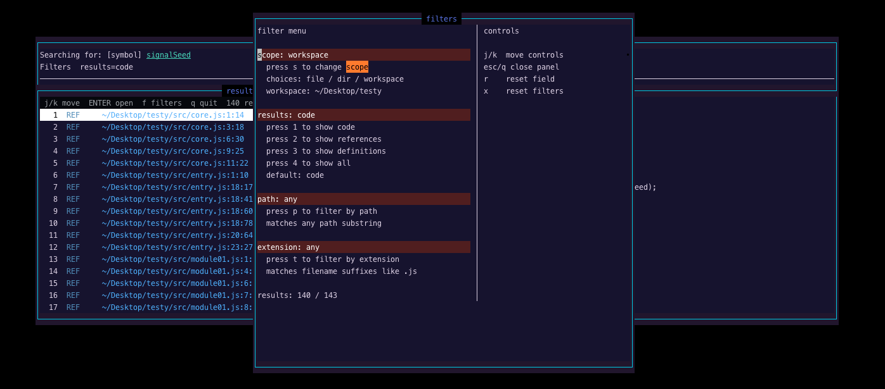

# peeper-picker.nvim

A focused Neovim usage picker for the symbol under your cursor.

peeper-picker is LSP-first, but not LSP-only. Language servers are the best
source of truth for definitions, declarations, and semantic references. But LSP
reference results can be incomplete: strings, templates, prose, comments,
generated edges, project root weirdness, and server indexing gaps can all hide
places where a symbol still matters.

To cover those misses, peeper-picker also runs a streaming workspace text search
for the same symbol. Literal matches that look like code are included with
`REF`; matches inside strings, prose files, and comments are kept separate as
`TXT` and `COM`, so you can see the broader picture without pretending every
textual match is a real semantic reference.

## Screenshots

<p align="center">
  
  <br>
  <sub>Main picker with results and preview</sub>
</p>

<p align="center">
  
  <br>
  <sub>Filter controls for scope, result type, path, and extension</sub>
</p>

## Requirements

- Neovim 0.12.2 or newer
- An attached LSP client that supports definition, declaration, or references is
  recommended. Without one you still get the workspace text search, just without
  the confirmed definition/reference tags.

## Installation

Recommended with lazy.nvim:

```lua
{
  "parwest/peeper-picker.nvim",
  main = "peeper_picker",
  cmd = "PeeperPicker",
  opts = {},
  keys = {
    { "<leader>pp", "<cmd>PeeperPicker<cr>", desc = "Peeper Picker" },
  },
}
```

This keeps the mapping in your personal Neovim config, where it belongs, and
lets lazy.nvim load the plugin from either `:PeeperPicker` or `<leader>pp`.

If you only want the command and no keymap:

```lua
{
  "parwest/peeper-picker.nvim",
  main = "peeper_picker",
  cmd = "PeeperPicker",
  opts = {},
}
```

Or enable the built-in default mapping. It is off by default so the plugin does
not take over your leader keyspace unless you ask it to. With lazy.nvim, prefer
the `keys` example above if you want the key itself to lazy-load the plugin.

```lua
{
  "parwest/peeper-picker.nvim",
  main = "peeper_picker",
  opts = {
    default_keymaps = {
      enabled = true,
      find = "<leader>pp",
    },
  },
}
```

With another plugin manager, load the plugin and call setup:

```lua
require("peeper_picker").setup({
  -- options go here
})
```

The plugin defines `:PeeperPicker` from `plugin/peeper-picker.lua` without
loading the full picker. Calling `require("peeper_picker").setup({ ... })`
applies your options and optional built-in keymap. If you enable the built-in
default keymap and later change or disable it with another setup call, the
previous built-in mapping is removed.

If you do not call `setup()`, `:PeeperPicker` still works with the default
options.

## Usage

Run `:PeeperPicker` with your cursor on a symbol. If your cursor is sitting on a
language keyword rather than a real symbol, the picker stays closed instead of
running a pointless lookup.

For Neovim help, run `:help peeper-picker`.

### Result types

Each result is tagged by where it came from:

| Tag | Meaning |
| --- | --- |
| `DEF` | A definition or declaration confirmed by the LSP |
| `REF` | A code occurrence, either LSP-confirmed or found by text search |
| `TXT` | A textual match inside a string, template, or prose file |
| `COM` | A textual match inside a comment |

`DEF` comes from the language server. `REF` includes LSP references plus
code-looking text matches that the language server did not report. `TXT` and
`COM` come from the workspace text search and only appear when the language
server didn't already report that location, so you never see the same hit twice.

Picker keys:

| Key | Action |
| --- | --- |
| `<CR>` | Open the selected result with your configured jump behavior |
| `<C-v>` | Open the selected result in a new vertical split |
| `<C-x>` | Open the selected result in a new horizontal split |
| `<C-t>` | Open the selected result in a new tab |
| `j` / `k` | Move selection |
| `f` | Open filters |
| `q` / `<Esc>` | Close |

Filter keys:

*you do not need to navigate your cursor to the filtering options to apply changes, just press the corresponding key*

| Key | Action |
| --- | --- |
| `s` | Cycle scope between file, directory, and workspace |
| `1` | Show code — definitions, references, and code occurrences (hides `TXT` and `COM`) |
| `2` | Show references — occurrences only, no definitions or declarations |
| `3` | Show definitions — declarations and definitions only |
| `4` | Show all — everything, including string, prose, and comment matches |
| `p` | Filter by path text. Start with `!` to exclude matching paths |
| `t` | Filter by extension. Start with `!` to exclude matching extensions |
| `r` | Reset the focused filter |
| `x` | Reset all filters |

## Configuration

Defaults:

```lua
{
  width = 92,
  height = 18,
  preview_width = 86,
  preview_context = 5,
  border = "single",
  title = " peeper-picker.nvim ",
  jump = "tabedit",
  reuse_window = true,
  default_keymaps = {
    enabled = false,
    find = "<leader>pp",
  },
  ignored_dirs = {},
  ignored_keywords = {},
}
```

`ignored_dirs` lets you add directory names to skip during the text search.
Whatever you list is **added** to the always-ignored built-in set (`.git`,
`node_modules`, `.next`, `dist`, `build`, `target`, `.cache`, `.venv`), so the
defaults keep working without any configuration:

```lua
opts = {
  ignored_dirs = { "vendor", "coverage", ".terraform" },
}
```

peeper-picker avoids opening on language keywords using Tree-sitter keyword
captures when available, plus built-in fallback keyword lists for common
development filetypes such as JavaScript, TypeScript, shell, Lua, Python, Go,
Rust, C/C++, Java, C#, PHP, Ruby, Elixir, Swift, Kotlin, Scala, SQL, Vimscript,
HTML, and CSS.

`ignored_keywords` lets you add your own cursor words that should not open the
picker. It is **added** to the built-in keyword fallbacks:

```lua
opts = {
  ignored_keywords = { "todo", "fixme" },
}
```

You can also scope additions by filetype, with `["*"]` for global additions:

```lua
opts = {
  ignored_keywords = {
    ["*"] = { "todo" },
    javascript = { "require" },
    sh = { "source" },
  },
}
```

Path and extension filters can be inverted with a leading `!`.

```text
src      show paths containing src
!src/    hide paths containing src/
js       show files ending in .js
!js      hide files ending in .js
```

For example, if you run peeper-picker on `signalSeed` from `src/example.js` and
want mentions outside `src`, open filters, press `p`, type `!src/`, and press
Enter. Root-level hits such as `scripts/check.js` stay visible while
`src/module.js` and other nested `src/` matches are hidden.

Extension filtering follows filename suffixes:

```text
!js       hide core.js and core.test.js
!test.js  hide core.test.js only
```

If the same symbol is mentioned in another language, press `t`, type `!.js`,
and press Enter to hide JavaScript files while keeping matches like
`tools/report.py`.

`jump` controls what `<CR>` does. It can be any Ex command that opens a file,
such as `"edit"`, `"split"`, `"vsplit"`, or `"tabedit"`.

```lua
opts = {
  jump = "edit",
}
```

It can also be a function for custom behavior:

```lua
opts = {
  jump = function(path, item)
    vim.cmd("vsplit " .. vim.fn.fnameescape(path))
  end,
}
```

By default, `reuse_window = true` jumps to an existing window if the selected
file is already open. Set it to `false` if `<CR>` should always run your `jump`
command. The split and tab picker mappings always create the requested split or
tab.

## Health

Run `:checkhealth peeper_picker` to check your Neovim version, attached LSP
clients, and whether the current buffer has an LSP client that supports
declaration, definition, or references.
