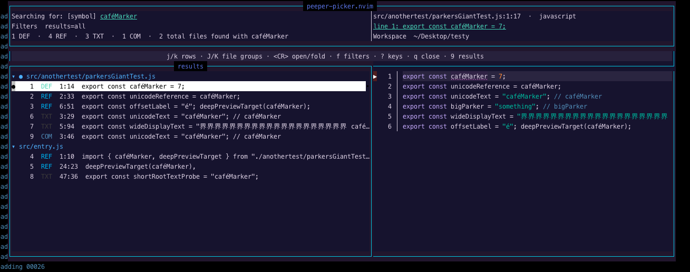
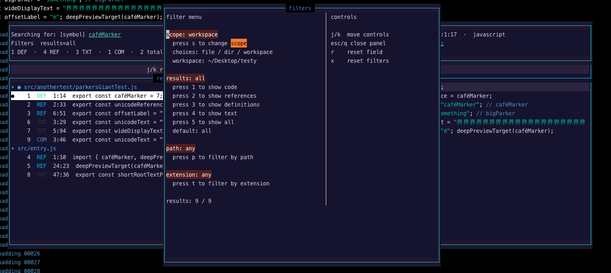
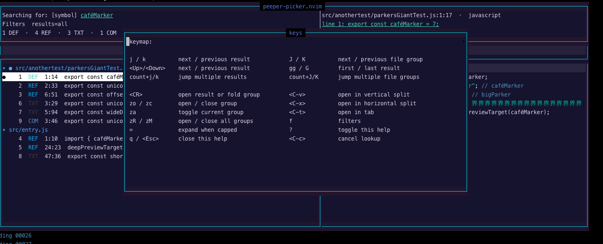

# peeper-picker.nvim

A focused Neovim usage picker for the symbol under your cursor.

Put your cursor on a symbol and peeper-picker shows you every place it lives.
Definitions, references, and the spots other tools miss: strings, comments,
templates, prose, and generated files. The whole picture, in one list.

It works by combining two sources. Your language server provides the definitions
and references it knows about, and a fast workspace text search catches everything
it doesn't. Each result is tagged by where it came from, so you always know what
you're looking at: `REF` for code, `TXT` for strings and prose, `COM` for
comments.

## Screenshots

<p align="center">
  
  <br>
  <sub>Main picker with results and preview</sub>
</p>

<p align="center">
  
  <br>
  <sub>Filter controls for scope, result type, path, and extension</sub>
</p>

## Requirements

- Neovim 0.11 or newer
- An attached LSP client that supports definition, declaration, or references

peeper-picker is LSP-gated: with no supporting client it does nothing (and
warns). The text search only augments live LSP results; it never runs on its
own.

## Installation

### lazy.nvim

```lua
{
  "parwest/peeper-picker.nvim",
  main = "peeper_picker",
  cmd = { "PeeperPicker", "PeeperPickerHistory" },
  opts = {},
  keys = {
    { "<leader>pp", "<cmd>PeeperPicker<cr>", desc = "Peeper Picker" },
    { "<leader>ph", "<cmd>PeeperPickerHistory<cr>", desc = "Peeper Picker History" },
  },
}
```

This lazy-loads the plugin on `:PeeperPicker` / `<leader>pp` (or
`:PeeperPickerHistory` / `<leader>ph`). Drop the `keys` block if you only want
the commands and no mappings.

### Setting your own keybinding

The `keys` table above is the place to define a custom mapping. Change
`<leader>pp` to whatever you like, and keep `<cmd>PeeperPicker<cr>` as the
action. Defining it here doubles as the lazy-load trigger: lazy installs the
mapping up front and loads the plugin the first time you press the key.

You can also map `:PeeperPicker` yourself. The command is registered up front
without loading the picker, so a plain
`vim.keymap.set("n", "<leader>pp", "<cmd>PeeperPicker<cr>")` works anywhere in
your config.

Or let the plugin create the mapping for you. It is off by default so the
plugin never claims leader keys unless you ask:

```lua
{
  "parwest/peeper-picker.nvim",
  main = "peeper_picker",
  opts = {
    default_keymaps = {
      enabled = true,
      find = "<leader>pp",
    },
  },
}
```

Because this block has no `keys`, `cmd`, or `event`, lazy loads the plugin at
startup, so the mapping is live from the first session and `<leader>pp` works
right away. The upside over a hand-written mapping is that the plugin owns it:
change `find` or set `enabled = false` and the old mapping is removed for you.

The one thing it can't do is lazy-load on the keypress itself. The mapping only
exists after the plugin has loaded, so if you instead defer loading with `cmd`
or `event`, the key does nothing until something else loads peeper-picker first.
For keypress lazy-loading, use the `keys` table above.

### Other plugin managers

Load the plugin and call setup:

```lua
require("peeper_picker").setup({
  -- options go here
})
```

Setup is optional: `:PeeperPicker` works with default options even if you never
call it. Calling setup applies your options and optional built-in keymap, and if
you later change or disable that keymap, the previous mapping is removed.

## Usage

Run `:PeeperPicker` with your cursor on a symbol. If your cursor is sitting on a
language keyword rather than a real symbol, the picker stays closed instead of
running a pointless lookup.

For Neovim help, run `:help peeper-picker`.

### Result types

Each result is tagged by where it came from:

| Tag    | Meaning                                                         |
| ------ | --------------------------------------------------------------- |
| `DEF`  | A definition confirmed by the LSP                               |
| `DECL` | A declaration confirmed by the LSP                              |
| `REF`  | A code occurrence, either LSP-confirmed or found by text search |
| `TXT`  | A textual match inside a string, template, or prose file        |
| `COM`  | A textual match inside a comment                                |

`DEF` and `DECL` come from separate language-server methods. When both methods
report the same location, `DEF` takes precedence. `REF` includes LSP references
plus code-looking text matches that the language server did not report. `TXT`
and `COM` come from the workspace text search and only appear when the language
server didn't already report that location, so you never see the same hit twice.

For source files, peeper-picker parses matching files with Tree-sitter when a
parser for their filetype is available, including files that are not open in a
buffer. Without a parser, prose files and full-line comments still use fallback
classification, while ambiguous strings and inline comments may appear as `REF`.

### Grouping and folding

Results are grouped by file. The primary definition file appears first; the
remaining files follow normal result order. The file where the picker was opened
and the exact source occurrence are marked with `●`. Select a file header and
press `<CR>` to collapse or expand it.

Picker keys:

| Key              | Action                                                               |
| ---------------- | -------------------------------------------------------------------- |
| `<CR>`           | Open a result, or collapse/expand a selected file group              |
| `J` / `K`        | Jump to the next / previous file group                               |
| `zo` / `zc` / `za` | Expand / collapse / toggle the current file group                  |
| `zM` / `zR`      | Collapse all / expand all file groups                                |
| `<C-v>`          | Open the selected result in a new vertical split                     |
| `<C-x>`          | Open the selected result in a new horizontal split                   |
| `<C-t>`          | Open the selected result in a new tab                                |
| `j` / `k`        | Move selection (wraps around the ends)                               |
| `gg` / `G`       | Jump to the first / last visible row                                 |
| `f`              | Open filters                                                         |
| `?`              | Open key help                                                        |
| `=`              | If text results are capped, rescan with the expanded limit           |
| `q` / `<Esc>`    | Close                                                                |

A count works like normal Vim motion: `5j` / `5k` move five rows and stop at the
end if there are fewer rows left.

### Expanding capped text results

The initial workspace text search stops after 5000 text matches to keep the
picker responsive. If that cap is reached, the help bar shows `= expand`. Press
`=` to rerun only the text search with `expanded_match_limit`; LSP definitions,
declarations, and references stay in the result set. If the cap was not reached,
`=` does nothing.

Filter keys:

_you do not need to navigate your cursor to the filtering options to apply changes, just press the corresponding key_

| Key | Action                                                                            |
| --- | --------------------------------------------------------------------------------- |
| `s` | Cycle scope between file, directory, and workspace                                |
| `1` | Show code — definitions, references, and code occurrences (hides `TXT` and `COM`) |
| `2` | Show references — occurrences only, no definitions or declarations                |
| `3` | Show definitions — declarations and definitions only                              |
| `4` | Show text — string, prose, and comment matches only (`TXT` and `COM`)             |
| `5` | Show all — everything, including string, prose, and comment matches               |
| `p` | Filter by path text. Start with `!` to exclude matching paths                     |
| `t` | Filter by extension. Start with `!` to exclude matching extensions                |
| `r` | Reset the focused filter                                                          |
| `x` | Reset all filters                                                                 |

### Key help

Press `?` in the picker for a built-in cheatsheet of every key, so you never
have to leave the picker to look one up.

<p align="center">
  
  <br>
  <sub>Built-in key help (<code>?</code>)</sub>
</p>

### Peek history

`:PeeperPickerHistory` opens a menu of the symbols you have recently peeked,
newest first. It is a plain list of names — one per line — and only names you
actually peeked ever appear. Move with `j`/`k`, press `<CR>` to peek a name
again, `c` to clear the list (it asks first), and `q` or `<Esc>` to close.

Peeking from history never moves your cursor or changes the buffer you are in,
so it is handy for jumping back to a symbol mid-refactor without losing your
place.

Renames are handled without any bookkeeping on your part. If you peek `oldName`
and later rename it to `newName`, the list still shows `oldName` — you never
peeked `newName`, so it does not appear until you do. Hitting `oldName` then
text-searches for `oldName` and surfaces the occurrences that still use the old
name (the stragglers a rename left behind). A name that still resolves to a live
symbol runs a full peek — LSP definitions and references plus the text search —
as usual.

Peeking the same name twice keeps a single entry, moved back to the top. History
is kept in memory for the session only (nothing is written to disk) and is
bounded by `history_size` (default 100; 0 disables history).

Map it the same way as `<leader>pp` — add
`{ "<leader>ph", "<cmd>PeeperPickerHistory<cr>", desc = "Peeper Picker History" }`
to your `keys` table (see [Installation](#lazynvim)).

## Configuration

Defaults:

```lua
{
  width = 92,
  height = 18,
  preview_width = 86,
  preview_context = 5,
  border = "single",
  title = " peeper-picker.nvim ",
  jump = "tabedit",
  reuse_window = true,
  expanded_match_limit = 50000,
  scan_files_per_tick = 64,
  classify_files_per_tick = 8,
  default_result_filtering = "all",
  history_size = 100,
  default_keymaps = {
    enabled = false,
    find = "<leader>pp",
    history = "<leader>ph",
  },
  ignored_dirs = {},
  ignored_keywords = {},
}
```

`scan_files_per_tick` limits how many queued files the built-in text search
opens per scheduler tick. `classify_files_per_tick` limits how many matching
files are classified with Tree-sitter per tick, keeping large scans responsive
without adding an external search dependency.

The initial workspace text search is capped at 5000 matches. When it hits the
cap, the picker shows `= expand` in the help bar. Press `=` to rerun the search
with `expanded_match_limit`, keeping your LSP definitions, declarations, and
references in the results. The `=` action only does something when the search
was actually capped.

```lua
opts = {
  expanded_match_limit = 75000,
}
```

`default_result_filtering` sets which result filter the picker opens with. It
defaults to `"all"`, so every match is visible up front, including string,
prose, and comment hits. Set it to `"code"`, `"references"`, `"definitions"`, or
`"text"` to start narrower:

```lua
opts = {
  default_result_filtering = "code",
}
```

You can still cycle the filter at runtime with the `1`/`2`/`3`/`4`/`5` keys in the
filter panel; this option only controls the starting state.

`ignored_dirs` lets you add directory names to skip during the text search.
Whatever you list is **added** to the always-ignored built-in set (`.git`,
`node_modules`, `.next`, `dist`, `build`, `target`, `.cache`, `.venv`), so the
defaults keep working without any configuration:

```lua
opts = {
  ignored_dirs = { "vendor", "coverage", ".terraform" },
}
```

peeper-picker avoids opening on language keywords using Tree-sitter keyword
captures when available, plus built-in fallback keyword lists for common
development filetypes such as JavaScript, TypeScript, shell, Lua, Python, Go,
Rust, C/C++, Java, C#, PHP, Ruby, Elixir, Swift, Kotlin, Scala, SQL, Vimscript,
HTML, and CSS.

`ignored_keywords` lets you add your own cursor words that should not open the
picker. It is **added** to the built-in keyword fallbacks:

```lua
opts = {
  ignored_keywords = { "todo", "fixme" },
}
```

You can also scope additions by filetype, with `["*"]` for global additions:

```lua
opts = {
  ignored_keywords = {
    ["*"] = { "todo" },
    javascript = { "require" },
    sh = { "source" },
  },
}
```

Path and extension filters can be inverted with a leading `!`.

```text
src      show paths containing src
!src/    hide paths containing src/
js       show files ending in .js
!js      hide files ending in .js
```

Extension filtering matches filename suffixes, so `!js` hides both `core.js` and
`core.test.js`, while `!test.js` hides only `core.test.js`.

`jump` controls what `<CR>` does. It can be any Ex command that opens a file,
such as `"edit"`, `"split"`, `"vsplit"`, or `"tabedit"`.

```lua
opts = {
  jump = "edit",
}
```

It can also be a function for custom behavior:

```lua
opts = {
  jump = function(path, item)
    vim.cmd("vsplit " .. vim.fn.fnameescape(path))
  end,
}
```

By default, `reuse_window = true` jumps to an existing window if the selected
file is already open. Set it to `false` if `<CR>` should always run your `jump`
command. The split and tab picker mappings always create the requested split or
tab.

## Health

Run `:checkhealth peeper_picker` to check your Neovim version, attached LSP
clients, and whether the current buffer has an LSP client that supports
declaration, definition, or references.

Both `:help peeper-picker` and `:checkhealth peeper_picker` require the plugin to
be on Neovim's `runtimepath`. Plugin managers usually handle this after install
or the first lazy-load. When testing a local checkout directly, add the checkout
to `runtimepath` and generate help tags first:

```vim
:set runtimepath+=/path/to/peeper-picker.nvim
:helptags /path/to/peeper-picker.nvim/doc
```
